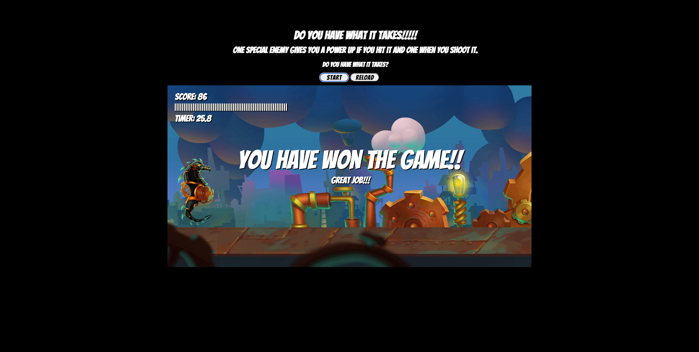

# Horseman
## GitHub repository link

## **[Horseman](https://aanglin.github.io/horseman)**
##  liscense: 
##  
#   Description

Used udemy course to build knowledge of javascript. I added on to the project a start and reload button and changed the difficulty of the game

#  Table of Contents

*  [Installation](#installation)
*  [License](#license)
*  [Contribution](#contribution)
*  [Questions](#questions)

#   Installation

This program can be ran through the provided website or you can clone the github repository and run npm start to start in local host.

#   License

This project is licensed under the

MIT license license

       
#   Contribution
<li>Myself (Aaron Anglin) </li>
<li>Udemy (Frank Dvorak) </li>

#   Questions

If you have any questions about the repo or to open an issue, you can contact me at:
 

###  Github: [aanglin](https://github.com) 
###  Email:  [aaron.anglin101@gmail.com](mailto:aaron.anglin101@gmail.com)  
